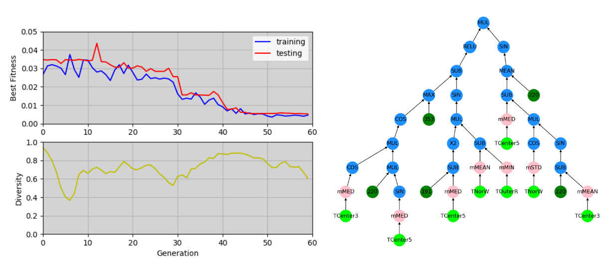

# TurboGP

TurboGP is a Python implementation of the Genetic Programming (GP) framework [1]. It is specifically designed for machine learning tasks. It supports many modern and popular GP features such as:

* Parallel processing: TurboGP can take advantage of systems with multiple CPU cores/threads in different ways, e.g. parallel evaluation of individuals in the population, or island subpopulations split across different CPUs along migration operations.

* On-line learning. TurboGP provides a variant of steady state population dynamics, specifically tailored to increase efficiency under mini-batch based learning/evolution. This method can significantly accelerate learning when dealing with large datasets [2].

* Spatially distributed populations. TurboGP supports models that allocate individuals in toroidal grid arrangements (aka cellular GP) [3], as well as provides export, import and migration operations to allow the implementation of multi-population (island) models [4].

* Layers of different types of nodes. TurboGP allows the representation and recombination of GP trees with different abstraction layers. These models are specially useful in high dimensional learning problems [5-7].

Besides the features mentioned above, TurboGP also implements different crossover operations (_protected_ crossover variants), it allows to graphically display the individuals/models generated, and allows live plotting of the fitness and diversity evolution.

  

## Getting Started

TurboGP ships with several jupyter notebooks that explain in detail how to use the library. The notebooks cover a simple regression example, under different scenarios (offline learning, online learning, parallel CPU usage), as well as an example on a multi-layered GP for image denoising. There is also a notebook that covers more in depth the inner workings of TurboGP (core classes and methods).

### Prerequisites

TurboGP should run on any version of Python >= 3.6.
However, graphically displaying individuals (Tree graphs) has only been tested in Python 3.6.x and 3.7.x.

Required libraries (most of these ship by default in recent conda distributions):

- numpy, matplotlib
- networkx, pygraph and pygraphviz (for models' visualization)
- TQDM (to display progressbar)

### Installing

You can clone the repo and run one of the included [notebooks](TGP\01. Simple regression example.ipynb) to verify that the library works properly in your system. 

## Authors

* **Lino Rodriguez-Coayahuitl** - [l1n0b1](https://github.com/l1n0b1)

See also the list of [contributors](AUTHORS) who participated in this project.

## License

This project is licensed under The GNU General Public License v3.0  - see the [LICENSE](LICENSE) file for details

## Changelog

### Version 1.0

First commit. Features included:
- Parallel individuals' evaluation.
- Low, mezzanine, high level primitives support.
- Genetic operations: subtree crossover, protected subtree crossover, subtree mutation, point mutation, etc.
- Migration operations: import, export, etc.
- Cellular and RecombinativeHillClimbing population models.
- Steady State dynamics with support for on-line learning.
- SimpleRegresor class for scalar regression .
- NonConvFilter, NonConvolutionalMezzanineFilter classes for image denoising.
- Live training, testing fitness, and diversity plotting; generated models visualization.

## References

[1] Koza, J. R., & Koza, J. R. (1992). Genetic programming: on the programming of computers by means of natural selection (Vol. 1). MIT press.

[2] Rodriguez-Coayahuitl, L., Morales-Reyes, A., & Escalante, H. J. (2019). Evolving autoencoding structures through genetic programming. Genetic Programming and Evolvable Machines, 20(3), 413-440.

[3] Petty, C. C. (1997). Diffusion (cellular) models. Handbook of evolutionary Computation.

[4] Martin, W. N., Lienig, J., & Cohoon, J. P. (1997). C6. 3 Island (migration) models: evolutionary algorithms based on punctuated equilibria. B ack et al. BFM97], Seiten C, 6, 101-124.

[5] Al-Sahaf, H., Song, A., Neshatian, K., & Zhang, M. (2012). Two-tier genetic programming: Towards raw pixel-based image classification. Expert Systems with Applications, 39(16), 12291-12301.

[6] Evans, B., Al-Sahaf, H., Xue, B., & Zhang, M. (2018, July). Evolutionary deep learning: A genetic programming approach to image classification. In 2018 IEEE Congress on Evolutionary Computation (CEC) (pp. 1-6). IEEE.

[7] Rodriguez-Coayahuitl, L., Morales-Reyes, A., & Escalante, H. J. (2019, November). A Comparison among Different Levels of Abstraction in Genetic Programming. In 2019 IEEE International Autumn Meeting on Power, Electronics and Computing (ROPEC) (pp. 1-6). IEEE.
